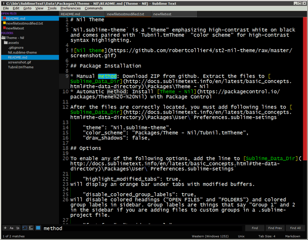

# Nil Theme

`Nil.sublime-theme` is a "theme" emphasizing high-contrast white on black and comes paired with `Tubnil.tmTheme` "color scheme" for high-contrast syntax highlighting.

The theme has been made simplistic and optimized for performance by minimizing the use of textures and images in favor of rectangle tints.

## Package Installation

* Manual method: Download ZIP from github. Extract the files to [Sublime_Data_Dir](http://docs.sublimetext.info/en/latest/basic_concepts.html#the-data-directory)\Packages\Theme - Nil
* Automatic method: Install [Theme - Nil](https://packagecontrol.io/packages/Theme%20-%20Nil) with Package Control

After the files are correctly located, you must add following lines to [Sublime_Data_Dir](http://docs.sublimetext.info/en/latest/basic_concepts.html#the-data-directory)\Packages\User\ `Preferences.sublime-setings`

    "theme": "Nil.sublime-theme",
    "color_scheme": "Packages/Theme - Nil/Tubnil.tmTheme",
    "font_face": "Lucida Console",
    "font_size": 13,
    "highlight_modified_tabs": true,
	"overlay_scroll_bars": "disabled",
	"draw_shadows": false,

## Options

To enable any of the following options, add the line to [Sublime_Data_Dir](http://docs.sublimetext.info/en/latest/basic_concepts.html#the-data-directory)\Packages\User\ `Preferences.sublime-setings`

    "disable_colored_group_labels": true,
will disable colored headings ("OPEN FILES" and "FOLDERS") and colored group labels in sidebar. Group labels are things that say "Group 1" and 2 in the sidebar if you add files to custom groups in a .sublime-project file.

## Credits

* `Nil.sublime-theme` - based upon [Raik Ilves's Pseudo OSX
theme](https://github.com/raik/st2-pseudo-osx-theme), which is in turn
based on [Ian Hill's Soda theme](https://github.com/buymeasoda/soda-
theme).  Additionally, this theme was inspired by [Liam Cain's Refresh
theme](https://github.com/BoundInCode/st2-refresh-theme), which is also
a variant of Pseudo OSX. So, it's worth noting that Raik's made a pretty
handy base for new themes.
* `Tubnil.tmTheme` - variation of Tubster theme for TextMate.
